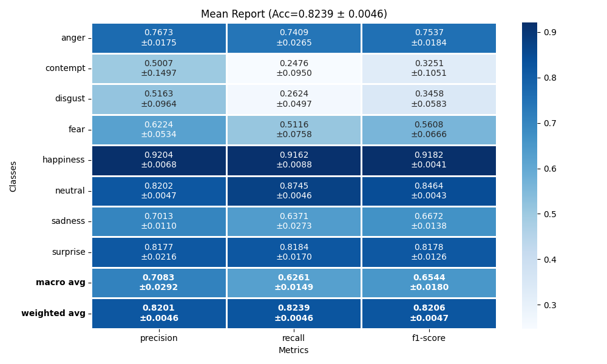
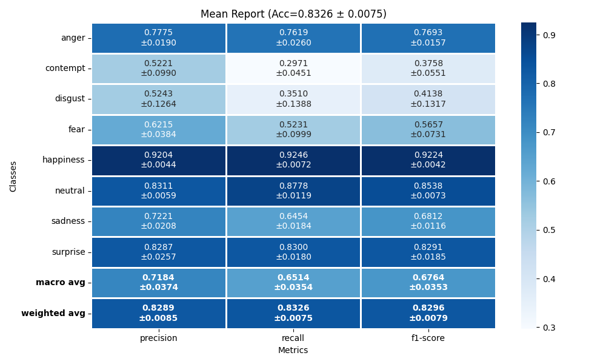
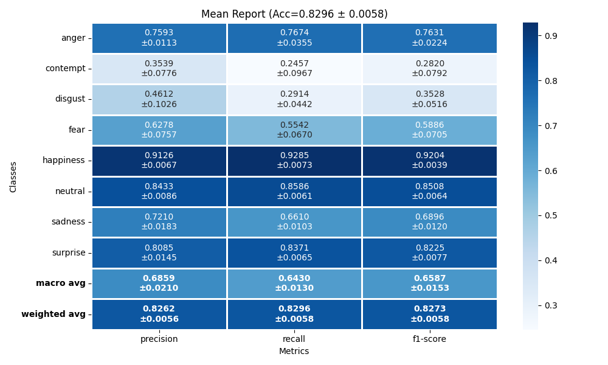
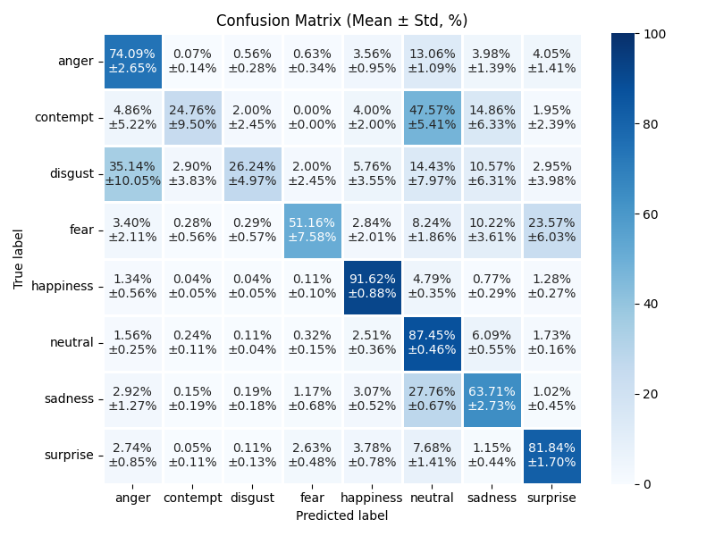
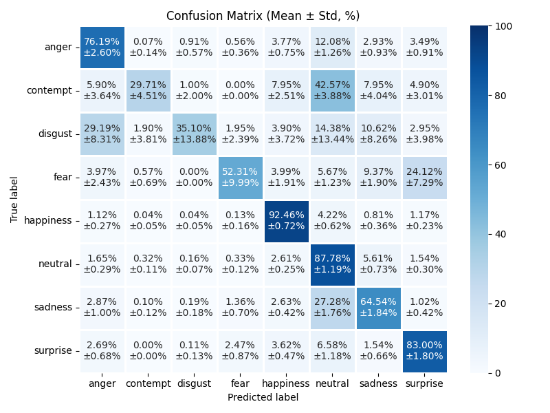

# Facial Emotion Recognition with dataset preprocessing 


This project implements a full pipeline for facial emotion recognition, including data preprocessing, CNN model training, and evaluation using stratified cross-validation with experiment tracking. The project is built with PyTorch.

## Project description

The preprocessing steps include: 
* Setting up the FER+ dataset based on the original .csv files.
* Detecting duplicate images within the dataset and removing them.
* Setting up directories with train/validation/test splits for a stratified 5-fold Cross-Validation.

Detecting duplicate images is done using computing phash and applying nearest-neighbor search which uses hamming distance as similarity metric. The duplicates are saved in seperate directories for visual verification. During the verification it was found that some of the same duplicate images were assigned to different classes, despite being corrected from FER+ 10-man voting. The total sum of votes for the duplicates were used to classify them to one class. The duplicates are removed keeping only one image sample.  

The training process includes: 
* Fine-tuning 3 choosen neural nets - ShuffleNetV2, ConveNext-Base and Swin-Base Transformer - for each iteration of stratified 5-fold Cross-Validation. 

Metrics used for model evaluations: 
* Recall, Precision and F1 score for each emotion class with averaged values 
* Confusion matrixes
* Accuracy 

All the metrics are gathered from each iteration of Cross-Validation and then used to calculate mean values with standard deviations for the entire process. 

The experiments were conducted in Google Colab on NVIDIA L4 GPU and the results were tracked via Weights & Biases. 

The .csv files used in this project can be found here:  
https://www.kaggle.com/datasets/nicolejyt/facialexpressionrecognition
https://github.com/microsoft/ferplus 

--- 

## Tech Stack

- **Core**: Python, PyTorch  
- **Machine Learning**: scikit-learn
- **Computer Vision**: imagehash 
- **Visualization**: matplotlib, seaborn 
- **Experiment Tracking**: Weights & Biases  

---

## Results

This section presents the results of the conducted experiments. Performance is evaluated using 5-fold stratified Cross-Validation on test sets. The reported results include per-class classification metrics (precision, recall, and F1-score). In addition, confusion matrices are provided to illustrate class-wise prediction performance. Final results are reported as mean values with standard deviations aggregated across all folds. 

<p align="center">
  
  
  
</p>
<p align="center"><em>Figure 1: Comparison of per-class classification metrics for ShuffleNetV2, ConvNext-Base and Swin-Base Transformer.</em></p>

<p align="center">
  
  
  
</p>
<p align="center"><em>Figure 2: Comparison of Confusion Matrices for ShuffleNetV2, ConvNext-Base and Swin-Base Transformer.</em></p>

---


## Project Structure

```text
UNet/
├── datasets/                           # Here are stored dirs for original dataset, k-fold CV subsets and duplicates 
   └── ...
├── metrics/           
    ├── classification_report.py        # Calculates classification report and plots it
    └── confusion_matrixes.py           # Calculates confusion matrix and plots
├── preprocessing/  
    ├── cv_fold_generator.py            # Creates structured directories for k-fold CV 
    ├── duplicate_finder.py             # Finds duplicates in original dataset
    ├── duplicate_remover.py            # Removes duplicates from original dataset
    └── fer_csv_reader.py               # Creates the directiory with original dataset images based on the provided .csv files
├── utils/                              
│   └── logging_config.py               # logging configuration
├── main.py                             # Main
├── train.py                            # Training loop
├── wandb_logger.py                     # Weights & Biases logging utilities
```

--- 

## License 
This project was made for educational purposes.